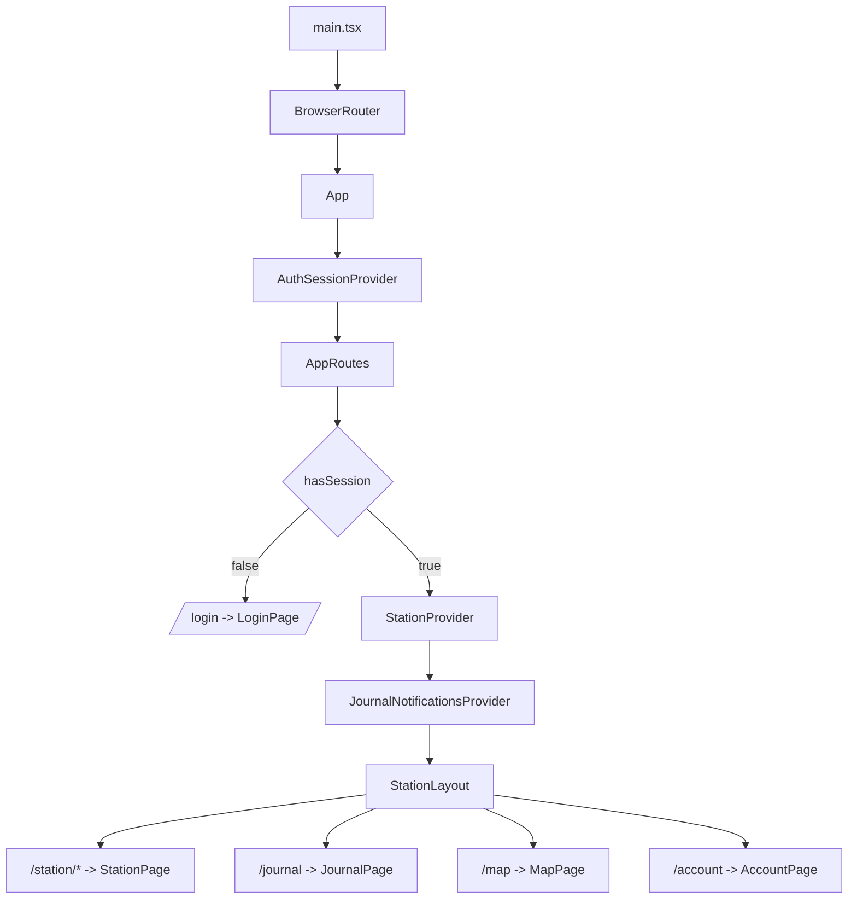
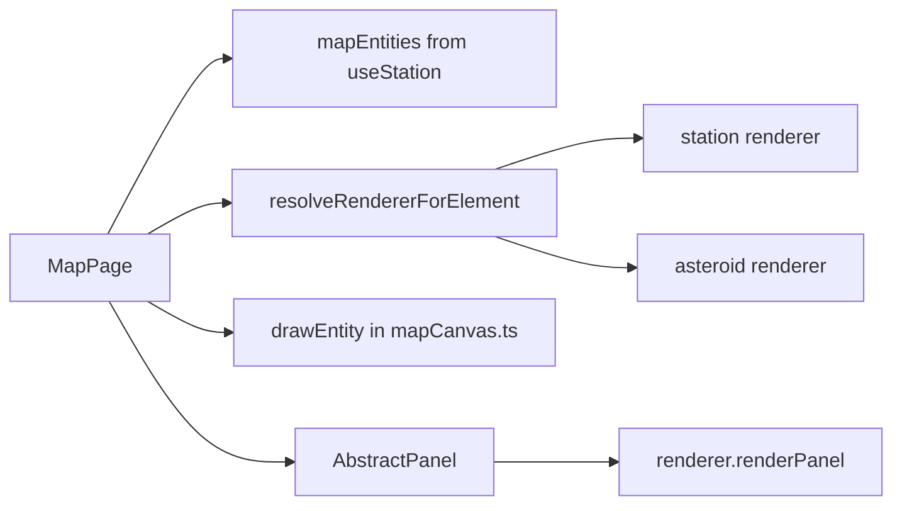
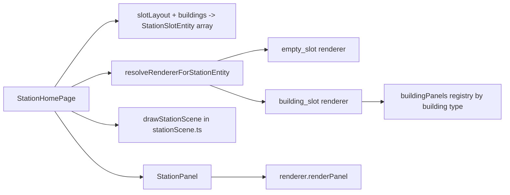
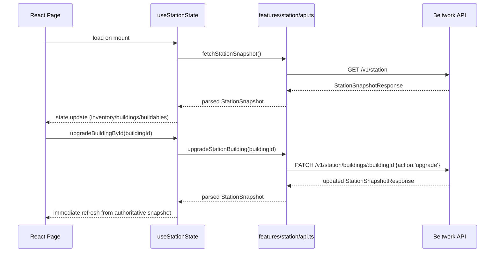

# Web Frontend Architecture Guide

This document explains the current `apps/web` architecture for non-frontend developers.
It focuses on responsibilities, data flow, and how React concepts are applied in this codebase.

## 1. Purpose and Scope

The web app is a React SPA responsible for:

- Authentication UX (`/login`, Start now, Google sign-in)
- Authenticated gameplay shell (`/station`, `/journal`, `/map`, `/account`)
- Station canvas interactions (slot selection, build, upgrade)
- Journal history rendering
- Map canvas interactions (pan/zoom/select/scan)
- Rendering API state and sending player actions back to API

The API remains authoritative. The web app does not simulate game state on its own.

## 2. Tech Stack (Web)

- React 19 + TypeScript
- React Router (client-side routing)
- Vite (dev/build)
- Tailwind CSS utilities
- Vitest + Testing Library (unit/component tests)

Entry point:

- `apps/web/src/main.tsx`

App root:

- `apps/web/src/App.tsx`

## 3. High-Level File Organization

`apps/web/src` is organized by responsibility:

- `features/`: domain-facing modules (auth and station API/context)
- `hooks/`: state orchestration hooks (session and station state)
- `pages/`: route-level screens and page-scoped submodules
- `components/`: shared layout UI (`StationLayout`)
- `types/`: shared front-end types
- `test/`: test environment setup

## 4. React Concepts Used Here

### 4.1 Component Types

This app uses three practical levels of components:

- Route/page components: `LoginPage`, `StationPage`, `JournalPage`, `MapPage`, `AccountPage`
- Layout components: `StationLayout`
- Feature/presentational components: map panels, station panels, building panel variants

### 4.2 Hooks

Hooks are the main unit of behavior:

- `useSessionProfileState`: auth session lifecycle and account settings actions
- `useStationState`: station/map snapshot loading, action handlers, selection state
- `useAuthSession`, `useStation`: safe context accessors

### 4.3 Context Providers

The app uses React Context for app-wide state sharing:

- `AuthSessionProvider` wraps the whole app
- `StationProvider` wraps authenticated routes
- `JournalNotificationsProvider` wraps the authenticated shell and reacts to refresh-driven journal updates

This avoids prop drilling and keeps pages focused on UI behavior.

### 4.4 Effects and Derived State

Patterns used heavily:

- `useEffect` for initial fetch and async lifecycle work
- `useMemo` for derived collections (`mapEntities`, selected entity)
- `useCallback` for stable action handlers passed to child components

## 5. Runtime Composition (Route and Provider Tree)

Key point: `StationProvider` state is shared across station/map/account pages, while `/journal`
uses the same authenticated shell but fetches its own page-local history data. Shell-wide
completion banners are driven separately by journal polling after successful refreshes.

## 6. Route Architecture and Responsibilities

### 6.1 `App.tsx`

Responsibilities:

- Chooses route tree based on auth state
- Redirects `/` to `/station` or `/login`
- Applies login background vs station background styling
- Wires login actions (`startNowAsGuest`, `signIn`, `signInWithGoogleToken`)

### 6.2 Station Route Surface

`StationPage` is a small route shell:

- `/station` -> `StationHomePage`
- `/station/*` -> local station-area not-found panel

This intentionally rejects old nested sections like dashboard/factories/buildings.

### 6.3 Journal Route Surface

`/journal` renders a dedicated `JournalPage` under the authenticated shell.

- Fetches `GET /v1/journal/events`
- Renders completed player-facing events with page-local filters and cursor pagination
- Uses page-local loading, empty, and error states

### 6.4 Authenticated Shell

`StationLayout` provides:

- Sidebar navigation: `/station`, `/journal`, `/map`, `/account`
- Commander/account summary
- Real refresh button that reloads station + map snapshots and updates the shell timestamp on success
- Shell-wide completion banner overlay for newly detected journal events
- Disconnect behavior and route return to `/login`

## 7. Feature Modules (Role of `features/`)

## 7.1 Auth Feature (`features/auth`)

Files:

- `api.ts`: all auth HTTP calls
- `AuthSessionProvider.tsx`: context provider exposing auth state/actions
- `useAuthSession.ts`: context access hook
- `GoogleSignInButton.tsx`: Google Identity script integration and button rendering

What this feature owns:

- Session bootstrap flow
- Login/start-now/logout commands
- Account update and Google linking commands
- Profile shape used by UI

## 7.2 Station Feature (`features/station`)

Files:

- `api.ts`: station/map HTTP API and response parsing
- `StationProvider.tsx`: context provider for station/map state
- `useStation.ts`: context access hook
- `iconPaths.ts`: centralized asset path helpers and fallbacks

What this feature owns:

- API-to-frontend model mapping (`snake_case` -> `camelCase`)
- Station build and upgrade calls
- Map snapshot fetch and asteroid scan call
- Icon path conventions for resources/buildings/asteroids/stations

## 8. Hooks Layer (Role of `hooks/`)

## 8.1 `useSessionProfileState`

This hook is the auth state machine for UI.

Owns:

- `hasSession`, `isBootstrapping`
- `profile`, `settingsForm`, `lastUpdatedAt`
- Actions: `startNowAsGuest`, `signIn`, `signInWithGoogleToken`, `saveSettings`, `disconnect`, `linkCurrentAccountWithGoogle`

Lifecycle:

- On mount: `bootstrapSession()`
- If unauthenticated: sets guest defaults
- If authenticated: loads profile and pre-fills settings form

## 8.2 `useStationState`

This hook is the gameplay read-model orchestrator.

Owns:

- Station data: `inventory`, `buildings`, `buildableBuildings`, `playerStation`
- Map data: `mapSnapshot`, `mapEntities`, selection refs
- Loading/error state for map/station actions
- Actions: `refreshMapSnapshot`, `refreshStationSnapshot`, `refreshShellData`, `buildBuildingInSlot`, `upgradeBuildingById`, selection setters
- Refresh signal: `snapshotRefreshRevision` for shell-level observers

Important behavior:

- Loads station snapshot and map snapshot on mount
- Applies snapshot through `applyStationSnapshot`
- Reconciles selected map element when map refresh changes entity set
- Increments a shared refresh revision after successful shell refreshes, due-event refreshes, and successful station actions

## 9. Page Layer (Role of `pages/`)

## 9.1 `LoginPage`

Pure auth entry UI:

- Email/password form -> delegated to parent handler
- Start now button -> delegated to parent handler
- `GoogleSignInButton` integration + local error messaging

## 9.2 `AccountPage`

Account settings UI:

- Reads and writes settings form via auth context setters
- Submits settings via `saveSettings`
- Handles Google linking via `linkCurrentAccountWithGoogle`

## 9.3 `MapPage`

Canvas-based world map screen.

Core responsibilities:

- Camera state: `scale`, `offset`, clamped to API `world_bounds`
- Pointer and wheel interactions (pan/zoom/select/hover)
- Canvas rendering using renderer registry + canvas utility functions
- Right-side panel rendering via `AbstractPanel`

## 9.4 `StationHomePage`

Canvas-based station home screen.

Core responsibilities:

- Builds slot entities from fixed layout + `buildings[].slotIndex`
- Camera state and clamped pan/zoom over station background image
- Slot hover/select hit detection
- Build and upgrade action dispatch
- Right-side contextual panel rendering via station renderer registry

## 9.5 `JournalPage`

Journal history screen responsibilities:

- Fetches completed journal events from the API
- Renders newest-first event rows with localized timestamps
- Maps backend importance (`info`, `important`, `warning`) to UI colors
- Shows loading, empty, and error states
- Owns history filters and pagination UI only; shell banners are separate

## 10. Components Layer (Role of `components/`)

`components/station/StationLayout.tsx` is the shared authenticated shell component:

- Mobile + desktop sidebar behavior
- Shared nav and profile summary
- Shared disconnect and real refresh controls
- Shared completion banner overlay that remains visible while navigating authenticated pages

## 11. Renderer + Panel Pattern

Both map and station use a renderer-registry approach.

Benefits:

- Canvas logic stays generic
- Domain-specific behavior lives in renderer/panel modules
- Easy to extend by adding renderer entries and panel components

## 11.1 Map Pattern

`entityRenderers.tsx` defines label/icon/tooltip/panel behavior per map element type.

## 11.2 Station Pattern

`buildingPanels.tsx` maps building type id -> panel component; unknown types fall back safely.

## 12. Data Flow: API to UI

## 13. Canvas Interaction Architecture

## 13.1 Shared Principles

Map and station canvases both implement:

- Resize-aware canvas dimensions (`ResizeObserver`)
- Camera transforms (`scale`, `offset`)
- Pointer world-coordinate conversion
- Drag-threshold protection to avoid accidental click-select during pan
- Overlay panel opening on selected entity

## 13.2 Map Camera

Defined in `pages/map/render/mapCanvas.ts`:

- `clampMapCameraOffset(...)` enforces world-bound camera limits
- `drawBackgroundAndWorldBorder(...)` paints the world border rectangle
- `drawEntity(...)` draws icon + selection ring
- `findNearestEntityHit(...)` performs hit-test in world coordinates

## 13.3 Station Camera

Defined in `pages/station/render/stationScene.ts`:

- `clampCameraOffset(...)` clamps view to station background image bounds
- `drawStationScene(...)` paints background and slot overlays
- Slot visuals differentiate empty platform vs building sprite
- `findNearestStationSlotHit(...)` performs slot hit-test

## 14. State and Ownership Boundaries

- Auth state ownership: `useSessionProfileState` (wrapped by `AuthSessionProvider`)
- Gameplay read-model ownership: `useStationState` (wrapped by `StationProvider`)
- Route ownership: `App.tsx`
- Shell/layout ownership: `StationLayout`
- Screen interaction ownership: page components (`MapPage`, `StationHomePage`, `JournalPage`)
- API transport/parsing ownership: `features/*/api.ts`

This separation keeps domain logic centralized while pages remain focused on interaction and rendering.

## 15. Testing Architecture

Web tests are Vitest + jsdom.

- Setup file: `src/test/setup.ts`
- Provides `@testing-library/jest-dom` matchers
- Stubs `ResizeObserver`
- Mocks `HTMLCanvasElement.getContext` for canvas component tests

Typical tests include:

- Route/auth flow behavior (`App.test.tsx`)
- Map canvas utility behavior (`mapCanvas.test.ts`)
- Panel rendering contracts (map and station panel tests)
- Station interaction behavior (`StationHomePage.test.tsx`)

## 16. How to Extend Safely

## 16.1 Add a New Authenticated Page

1. Create a page component in `pages/`.
2. Add route in `App.tsx` under the authenticated route branch.
3. Add nav link in `StationLayout` if user-facing.
4. Reuse context hooks (`useAuthSession` / `useStation`) instead of duplicating fetch logic.

## 16.2 Add a New Station Building Panel Type

1. Create panel component in `pages/station/panels/`.
2. Register it in `buildingPanels.tsx` by building type key.
3. Ensure API returns matching `building_type` values.
4. Optional: add icon file aligned with `getBuildingIconPath` naming convention.

## 16.3 Add a New Map Entity Type

1. Extend `MapElement` and related types in `types/app.ts`.
2. Add renderer entry in `pages/map/panels/entityRenderers.tsx`.
3. Ensure `MapPage` receives entity data from `useStationState` and API parsing.

## 17. Quick Glossary

- Feature: domain module owning API calls and context contracts.
- Hook: reusable state+behavior unit.
- Provider: context wrapper that supplies hook state to descendants.
- Page: route-level screen orchestrating interactions.
- Component: reusable UI unit.
- Renderer registry: map from entity type to behavior for label/icon/tooltip/panel.
